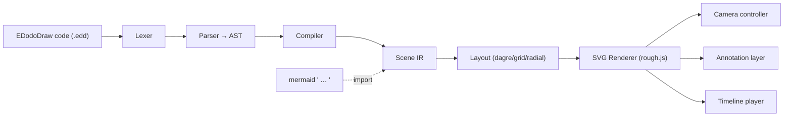

# EDodoDraw Architecture

EDodoDraw is a **100% code-to-diagram engine** with the Excalidraw hand-drawn aesthetic, a magic-move camera, and scriptable + real-time annotations. It is built from the ground up (no Excalidraw runtime) on three reused primitives: **rough.js** (hand-drawn strokes), **dagre** (auto-layout), and **@excalidraw/mermaid-to-excalidraw** (Mermaid import). The hand-drawn font is the OFL-licensed **Virgil/Excalifont**.

## The pipeline

Everything flows through the **Scene IR** (`src/engine/scene/types.ts`) — a flat, serializable model of nodes, edges, groups, annotations, and timeline steps. The DSL, the Mermaid importer, and any programmatic caller all produce a `Scene`; the renderer and controllers only consume one. This is the single contract that keeps the system decoupled.

## Modules

| Area | Path | Responsibility | Guide |
|---|---|---|---|
| Scene IR | `src/engine/scene/` | Types, palette, factories, anchors, queries | — |
| DSL | `src/engine/dsl/` | `lexer → parser → ast → compile` + diagnostics | [DSL_LANGUAGE_GUIDE](DSL_LANGUAGE_GUIDE.md) |
| Layout | `src/engine/layout/` | dagre/grid/radial → node positions | — |
| Renderer | `src/engine/render/` | SVG + rough.js, shapes, edges, arrowheads, fonts | — |
| Camera | `src/engine/camera/` | fit math, easing, animated controller | [CAMERA_AND_TIMELINE_GUIDE](CAMERA_AND_TIMELINE_GUIDE.md) |
| Timeline | `src/engine/timeline/` | beat player (magic-move) | [CAMERA_AND_TIMELINE_GUIDE](CAMERA_AND_TIMELINE_GUIDE.md) |
| Annotations | `src/engine/annotate/` | render layer + live interactive editor | [ANNOTATIONS_GUIDE](ANNOTATIONS_GUIDE.md) |
| Import/Export | `src/engine/import/`, `src/engine/export.ts` | Mermaid in; SVG/PNG/JSON out | [IMPORT_AND_EXPORT_GUIDE](IMPORT_AND_EXPORT_GUIDE.md) |
| Plugins | `src/engine/plugins/` | shape registry (extension seam) | [DEVELOPMENT_STANDARDS](DEVELOPMENT_STANDARDS.md) |
| App | `src/app/` | React playground: editor, canvas, toolbar, player | [DEVELOPMENT_STANDARDS](DEVELOPMENT_STANDARDS.md) |

`src/engine/index.ts` is the public barrel; the app imports only from `@engine/*`.

## Key decisions

- **SVG, not Canvas.** The world layer is one `<g>` whose `transform` attribute is the camera. This makes the magic-move camera a single attribute update per frame, GPU-friendly, and lets annotations/animated arrows be DOM elements with CSS animations. Trade-off: not ideal for tens of thousands of elements — fine for diagrams.
- **Imperative renderer outside React.** `SvgRenderer` owns the SVG DOM directly (like Excalidraw owns its canvas). React only mounts the container and drives high-level state. Full re-render on scene change; camera/animation mutate transforms only.
- **Deterministic hand-drawn strokes.** Every element gets a stable rough.js `seed` (hash of its id) so re-rendering never re-jitters strokes.
- **Open unions + registries.** `ShapeKind`, `ArrowAnimationKind`, and `AnnotationKind` are open string unions; unknown values resolve through registries (`src/engine/plugins/`). New shapes/animations need no grammar or core change.
- **Sync compiler, async Mermaid.** The DSL compiler is synchronous and DOM-free (unit-testable in Node). Mermaid rendering needs the browser, so the app awaits `convertMermaid` and injects the fragment — the compiler itself stays pure.

## Rendering layers (bottom → top)

`bg (screen)` · `grid` · `groups` · `edges` · `nodes` · `annotations` (scripted) · `live` (interactive) — the last two sit in the camera-transformed world layer so annotations track the diagram. See `src/engine/render/svgRenderer.ts`.

## Testing

- Unit tests (vitest, jsdom): `tests/` — lexer, parser, compiler, lowering, layout, camera math, anchors, annotations round-trip. Run `npm test`.
- Visual smoke: `scripts/qa/smoke.sh` drives every example with `playwright-cli` and fails on console errors. Two-stage testing per `docs`-referenced FE guide: code-level first, end-user browser interaction last.
